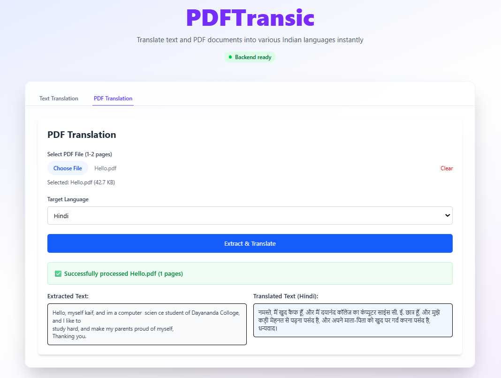
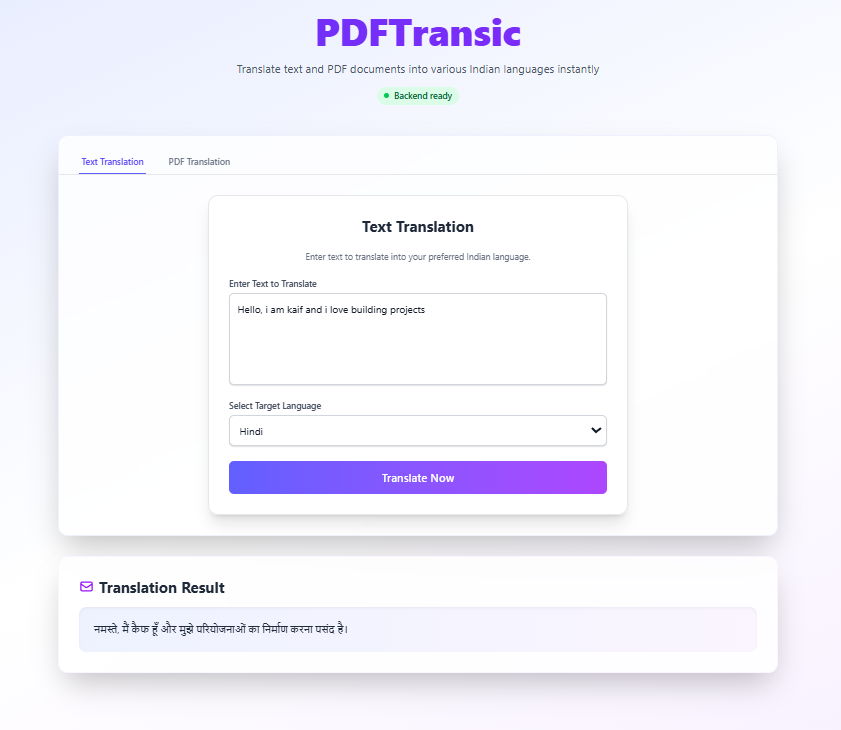

# PDFTransic

A full-stack AI-powered application for translating English text and PDF documents to 22+ Indian languages using the IndicTrans2 model.

## 🌐 Live Demo

**🚀 Try it now: [https://pdftransic-frontend.vercel.app/](https://pdftransic-frontend.vercel.app/)**

## 🎯 Project Overview

PDFTransic is designed to bridge language barriers by providing seamless translation of both text and PDF documents into 22+ Indian languages. The application leverages the powerful [IndicTrans2 model](https://github.com/AI4Bharat/IndicTrans2) by AI4Bharat for accurate translations while offering a modern, user-friendly interface.

## 📸 Screenshots

### Text Translation Interface


### PDF Translation Interface  


## ✨ Key Features

- **📝 Text Translation**: Direct text input translation to Indian languages
- **📄 PDF Translation**: Extract and translate content from PDF documents
- **🌐 Multi-language Support**: Support for 22+ Indian languages including Hindi, Tamil, Telugu, Bengali, Gujarati, Marathi, Malayalam, Punjabi, Kannada, Odia, Assamese, Urdu, Sanskrit, Nepali, and more
- **⚡ Real-time Processing**: Fast translation using [IndicTrans2 model](https://github.com/AI4Bharat/IndicTrans2)
- **🎨 Modern UI**: Clean and responsive React interface with Tailwind CSS
- **📊 Health Monitoring**: Built-in backend health status monitoring
- **📚 API Documentation**: Interactive API documentation with FastAPI

## 🏗️ Architecture

- **Backend**: FastAPI with IndicTrans2 model integration (Pyback1/) - [HuggingFace Spaces](https://syedkaif29-pdftransic.hf.space)
- **Frontend**: React with TypeScript and Tailwind CSS (Pyfornt/transfornt/) - [Vercel](https://pdftransic-frontend.vercel.app/)
- **Translation Engine**: [IndicTrans2](https://github.com/AI4Bharat/IndicTrans2) via IndicTransToolkit
- **PDF Processing**: Built-in PDF text extraction capabilities

## 🚀 Setup Instructions

### Backend Setup (FastAPI)

1. Navigate to the backend directory:

```bash
cd Pyback1
```

2. Create and activate virtual environment:

```bash
python -m venv .venv
# On Windows:
.venv\Scripts\activate
# On macOS/Linux:
source .venv/bin/activate
```

3. Install dependencies:

```bash
pip install -r requirements.txt
```

4. Start the server:

```bash
python start_server.py
```

The server will be available at `http://localhost:8000` with API documentation at `http://localhost:8000/docs`.

### Frontend Setup (React + TypeScript)

1. Navigate to the frontend directory:

```bash
cd Pyfornt/transfornt
```

2. Install dependencies:

```bash
npm install
```

3. Start the development server:

```bash
npm run dev
```

The frontend will be available at `http://localhost:5173`.

## 🌍 Supported Languages (22+)

PDFTransic supports translation from English to the following Indian languages using [IndicTrans2](https://github.com/AI4Bharat/IndicTrans2):

| Language | Script | Code |
|----------|--------|------|
| **Assamese** | Bengali | `asm_Beng` |
| **Bengali** | Bengali | `ben_Beng` |
| **Bodo** | Devanagari | `brx_Deva` |
| **Dogri** | Devanagari | `doi_Deva` |
| **Gujarati** | Gujarati | `guj_Gujr` |
| **Hindi** | Devanagari | `hin_Deva` |
| **Kannada** | Kannada | `kan_Knda` |
| **Kashmiri** | Arabic | `kas_Arab` |
| **Kashmiri** | Devanagari | `kas_Deva` |
| **Konkani** | Devanagari | `gom_Deva` |
| **Maithili** | Devanagari | `mai_Deva` |
| **Malayalam** | Malayalam | `mal_Mlym` |
| **Manipuri** | Bengali | `mni_Beng` |
| **Manipuri** | Meitei Mayek | `mni_Mtei` |
| **Marathi** | Devanagari | `mar_Deva` |
| **Nepali** | Devanagari | `npi_Deva` |
| **Odia** | Odia | `ory_Orya` |
| **Punjabi** | Gurmukhi | `pan_Guru` |
| **Sanskrit** | Devanagari | `san_Deva` |
| **Santali** | Ol Chiki | `sat_Olck` |
| **Sindhi** | Arabic | `snd_Arab` |
| **Sindhi** | Devanagari | `snd_Deva` |
| **Tamil** | Tamil | `tam_Taml` |
| **Telugu** | Telugu | `tel_Telu` |
| **Urdu** | Arabic | `urd_Arab` |

## 🔧 API Endpoints

- `GET /health` - Health check and model status
- `POST /translate` - Translate text to specified Indian language
- `POST /translate-pdf` - Extract and translate PDF content
- `GET /docs` - Interactive API documentation

## 💻 Development

### Backend Development

- Main FastAPI application: `Pyback1/main.py`
- Server startup script: `Pyback1/start_server.py`
- Dependencies: `Pyback1/requirements.txt`

### Frontend Development

- React components: `Pyfornt/transfornt/src/components/`
- Translation API service: `Pyfornt/transfornt/src/services/translationApi.ts`
- Main app component: `Pyfornt/transfornt/src/App.tsx`

## 📋 System Requirements

- **Python**: 3.8 or higher
- **Node.js**: 16 or higher
- **RAM**: At least 4GB (for model loading)
- **Storage**: 2GB+ free space (for models)
- **OS**: Windows, macOS, or Linux

## ⚠️ Important Notes

- **First Startup**: Model loading may take 3-5 minutes on first startup
- **Health Check**: Monitor the `/health` endpoint to verify when models are ready
- **PDF Limitations**: Optimized for 1-2 page PDFs for best performance
- **Model Dependencies**: Uses IndicTransToolkit for translation capabilities

## 🤝 Contributing

1. Fork the repository
2. Create a feature branch
3. Make your changes
4. Test thoroughly
5. Submit a pull request

## �‍💻 eCreator

**Developed by:** [Syedkaif29](https://github.com/Syedkaif29)  
**Repository:** [https://github.com/Syedkaif29/PdfTransic](https://github.com/Syedkaif29/PdfTransic)

## 🙏 Acknowledgments

- **IndicTrans2 Model**: [AI4Bharat/IndicTrans2](https://github.com/AI4Bharat/IndicTrans2) - State-of-the-art neural machine translation model for Indian languages
- **AI4Bharat**: For developing and open-sourcing the IndicTrans2 model
- **IndicTransToolkit**: For providing the Python toolkit for IndicTrans2 integration

## 📄 License

This project is open source and available under the MIT License.